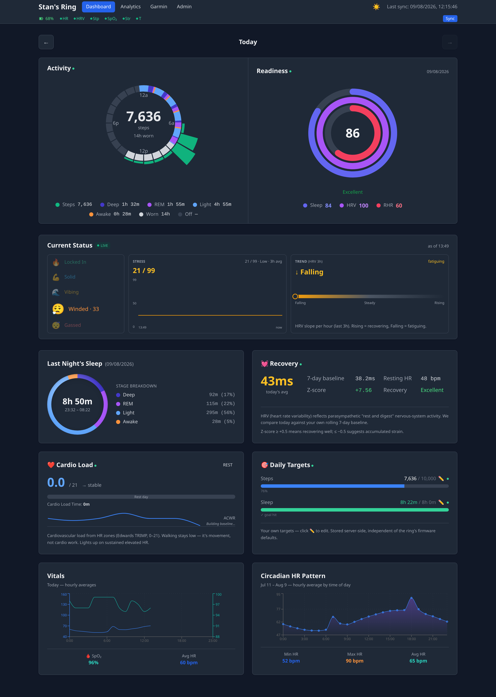
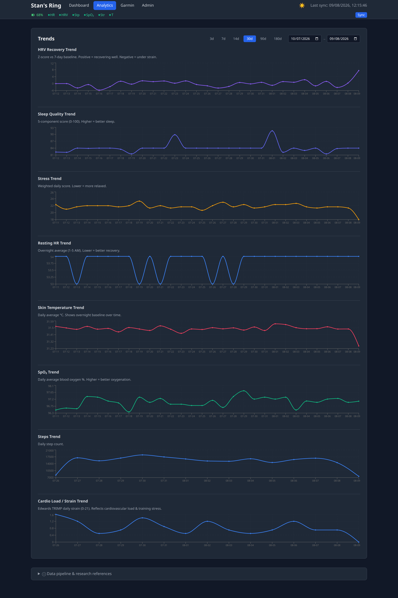
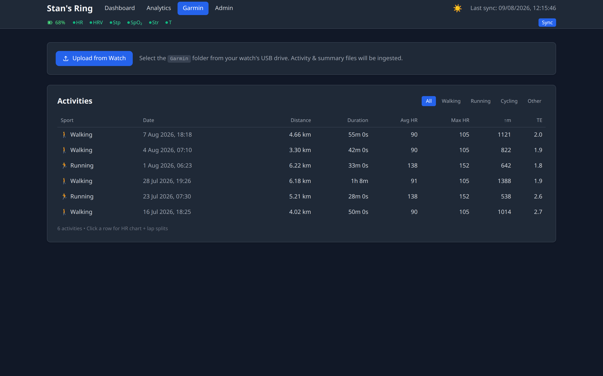
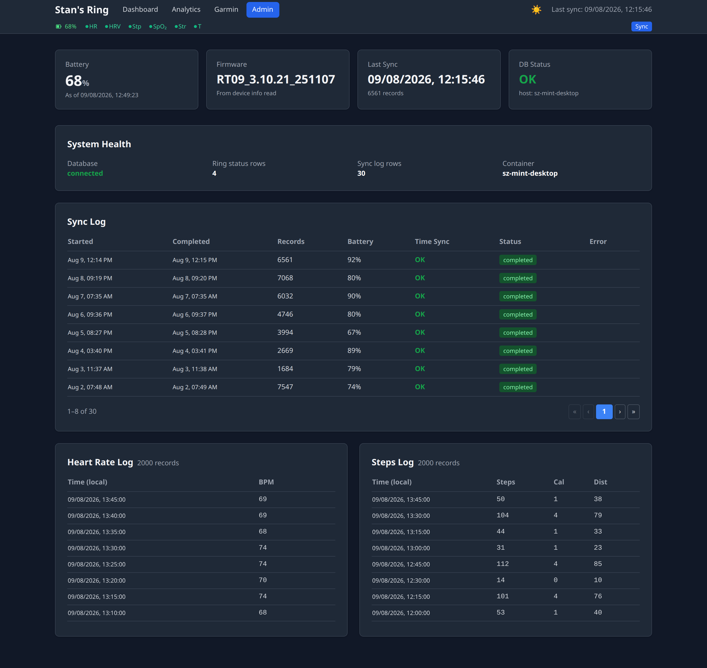

# Smart Ring 💍

Open-source health data pipeline built around the **Colmi R09** — a $45 CAD hackable smart ring with the same form factor as a $530 Oura ring, zero BLE authentication, and full protocol documentation.

## Screenshots

Dark mode, rendered from 30 days of synthetic demo data (see `scripts/seed_demo_data.py` — no real health data or GPS routes).

<p align="center">
  
  
  
  
</p>

## Goal

Build a private, self-hosted health tracking system that:

- **Collects** biometric data from the ring via BLE (HR, HRV, SpO2, skin temperature, stress, sleep stages, steps)
- **Stores** everything in Postgres — raw sensor data + computed metrics
- **Computes** validated health scores: sleep quality (5-component), recovery (HRV z-score), stress classification
- **Visualizes** in a dashboard — local-first, dark mode, accessible via Tailscale
- **Stays hackable** — no subscriptions, no vendor lock-in, no cloud dependency

## Hardware

| Component | Detail |
|-----------|--------|
| **Ring** | Colmi R09 (~$45 CAD) — BlueX RF03 SoC, accelerometer + PPG + SpO2 + skin temperature |
| **BLE** | Standard Nordic UART Service, zero auth. Fully open protocol at [colmi.puxtril.com](https://colmi.puxtril.com/commands/) |
| **CFW** | [atc1441/ATC_RF03_Ring](https://github.com/atc1441/ATC_RF03_Ring) — custom firmware via web OTA flasher |

## Key Tools

- [tahnok/colmi_r02_client](https://github.com/tahnok/colmi_r02_client) — Python BLE client + protocol docs
- [atc1441/ATC_RF03_Ring](https://github.com/atc1441/ATC_RF03_Ring) — Custom firmware + SDK
- [Gadgetbridge](https://codeberg.org/Freeyourgadget/Gadgetbridge) — Open-source Android client

## Deployment

**Local-first, fully wired up.** System systemd units on the Linux box: rootless Podman
(`podman run`, not quadlets) for Postgres + FastAPI, bare-metal Python venv for the BLE
collector (BlueZ/DBus) and the poller. Ops details: [`docs/RUNTIME.md`](docs/RUNTIME.md).

```
Home Network
└─ Linux Mint Box (AMD 3800x, 64GB RAM, BT enabled)
   ├─ smart-ring-db.service      (system unit → rootless podman, Postgres 16)
   │   └─ 127.0.0.1:5432, volume smart-ring-pgdata
   ├─ smart-ring-api.service     (system unit → rootless podman, FastAPI)
   │   ├─ Requires=smart-ring-db.service
   │   ├─ 0.0.0.0:8000, serves dashboard (firewall-gated: loopback + LAN + Tailscale)
   │   └─ smart-ring-api-firewall.service (nftables gate on :8000, see RUNTIME.md §3.1)
   ├─ smart-ring-poller.service  (system unit, bare metal)
   │   └─ 30s poll of sync_requests → sync_ring + analytics
   └─ Manual collector: venv/bin/python3 -m collector.sync_ring --forget
```

**Podman must use production storage:** `export XDG_DATA_HOME=/opt/smart-ring/.local/share`
before any `podman` command. Bare `podman ps` looks at `~` and is often empty while the
stack is running — that is not “services down.”

Dashboard: React + TypeScript app with four tabs — **Dashboard** (unified hero panel: 24h activity ring with wear/sleep/step radial bars + Readiness Score 0–100 with sub-scores + contributors; current status 3-box panel with vibe ladder + stress sparkline + trend gradient; recovery card; sleep donut; vitals hourly chart; circadian HR pattern), **Analytics** (trend charts with click-to-zoom + breadcrumb navigation, time-scale presets 3/7/14/30/90/180d, hourly resolution when zoomed to single day, methodology help popovers), **Garmin** (activity list with sport filter, session detail with HR chart + lap splits, GPS route map, FIT file upload), and **Admin** (ring status, system health, sensor freshness chips, full sync log with pagination, raw HR/steps tables). Built with Vite → `dashboard/dist/`. **Installable PWA** — manifest + offline-shell service worker + icons; install to home screen on Android Chrome (or any Chromium browser), works offline once cached. Always-visible sensor freshness chips in nav (HR/HRV/Steps/SpO₂/Stress/Temp) replace the old surprise amber banner.

## Usage

```bash
# One-time setup (already done for this ring)
#   - venv created, deps installed (pip install -e .)
#   - ring paired via bluetoothctl (address: <ring_ble_address>)
#   - Gadgetbridge installed on phone (Android)

# Pair the ring (one-time, via bluetoothctl — already done)
bluetoothctl scan on
bluetoothctl pair <ring_address>      # wait for "Pairing successful"
bluetoothctl disconnect <ring_address>

# Daily operations
venv/bin/python3 -m collector.first_contact     # read-only diagnostic (battery, fw, clock)
venv/bin/python3 -m collector.sync_ring --forget  # full sync to Postgres (forget+repair is default)
# Or use the dashboard: click "Sync Now" in the Admin tab
#   (the poller watches sync_requests every 30s — no manual cron)

# Run the regression net before any refactor
venv/bin/python3 -m pytest tests/               # 132 tests, ~5s
```

## Documentation

Detailed docs live in **[`docs/`](docs/)**:

- **[`docs/RUNTIME.md`](docs/RUNTIME.md)** — how the stack actually runs: dual Podman store, system units, ports, volumes, commands that work.
- **[`docs/RING_BEHAVIOR.md`](docs/RING_BEHAVIOR.md)** — empirical Colmi R09 behavior: connection quirks, per-data-type reference (interval / buffer / publish cadence / format), V2 big-data protocol, background-logger stall, time-sync.
- **[`docs/RESEARCH.md`](docs/RESEARCH.md)** — hardware specs, validated score formulas (with peer-reviewed citations), readiness score gap analysis (Oura vs WHOOP vs Garmin), value-add analysis, Oura comparison.
- **[`docs/DATA_QUALITY.md`](docs/DATA_QUALITY.md)** — freshness thresholds per data type, peer-lag logic, false-alarm prevention.
- **[`docs/GARMIN_INTEGRATION_RESEARCH.md`](docs/GARMIN_INTEGRATION_RESEARCH.md)** — Garmin 745 integration design (privacy, sync options, schema, phases, Phase 1.5 blocker).
- **[`docs/ACTIVITY_DETECTION_RESEARCH.md`](docs/ACTIVITY_DETECTION_RESEARCH.md)** — activity/strain detection design (Edwards TRIMP, zone minutes, segments). Not built yet.
- **[`docs/PACKAGED_APP.md`](docs/PACKAGED_APP.md)** — design review for a standalone, container-free, SQLite-backed packaged app (Gadgetbridge model). Not built yet.
- **[`docs/done/ROADMAP.md`](docs/done/ROADMAP.md)** — mobile sync design (WebBluetooth PWA + Gadgetbridge fork options). Historical.
- **[`docs/done/PWA_PLAN.md`](docs/done/PWA_PLAN.md)** — installable PWA: manifest, offline-shell service worker strategies, icon generation, verification. Shipped.
- **[`docs/done/CLEANUP_PLAN.md`](docs/done/CLEANUP_PLAN.md)** — refactor history (collector/analytics Phases 0–4 + API cleanup Steps 1, 2, 4 + Tier 1 test suite). All complete.
- **[`docs/done/DASHBOARD_REWRITE_PLAN.md`](docs/done/DASHBOARD_REWRITE_PLAN.md)** — React + TypeScript dashboard rewrite: phased plan, stack choices, PWA/cutover strategy. **Complete — shipped 2026-07-26.**
- **[`AGENTS.md`](AGENTS.md)** — operational/deployment context (architecture, service commands, current state, work log).
- **[`TASKS.md`](TASKS.md)** — phase history, open backlog, CFW ideas, readiness improvements.

## Development

This project was built with use of AI/Vibe coding tools, primarily OpenCode as harness and various open weight models.

### Test suite

279 tests across 15 files, ~25s total runtime:

```bash
venv/bin/python3 -m pytest tests/                # full suite
venv/bin/python3 -m pytest tests/test_current_status.py -v  # one file
```

| File | Tests | What it covers |
|------|-------|----------------|
| `tests/test_trap_score.py` | 20 | Trapezoidal scoring math — boundaries, ramp linearity, symmetry |
| `tests/test_time_sync_bcd.py` | 16 | Sacred BCD encoding — byte-for-byte vs Gadgetbridge's `setDateTime` |
| `tests/test_dedupe.py` | 13 | Source dedup contract — phone vs ring overlap (ephemeral PostgreSQL) |
| `tests/test_mobile_sync.py` | 16 | `/api/mobile/sync` end-to-end via FastAPI TestClient |
| `tests/test_current_status.py` | 36 | Pure-function boundaries for Current Status formula components + weighted aggregate |
| `tests/test_readiness_freeze.py` | 9 | Pure `should_freeze` helper + DB-backed freeze gate (skip-if-already-frozen) |
| `tests/test_source_priority.py` | 8 | N-source priority resolver — which source wins per metric |
| `tests/test_data_quality.py` | 22 | Freshness classification — peer-lag, logger stall, false-alarm prevention |
| `tests/test_steps_drain.py` | 6 | Steps queue pollution fix — drain before each per-day request |
| `tests/test_strain_trend.py` | 7 | Edwards TRIMP strain + cardio load calculation |
| `tests/test_heart_rate_zones.py` | 9 | HR zone minutes + zone distribution |
| `tests/test_garmin_parser.py` | 26 | FIT file discovery, session/lap/trackpoint parsing, sport translation |
| `tests/test_garmin_ingest.py` | 9 | End-to-end Garmin ingest, idempotency by path + hash |
| `tests/test_garmin_monitoring.py` | 15 | Monitoring file framework (extractors stubbed, pending FIT SDK decode) |
| `tests/test_garmin_api.py` | 14 | Garmin activity endpoints — list, detail, trackpoints, HR, laps |

DB-backed tests use an ephemeral `smart_ring_test_<pid>` database created from `db/init.sql` — never touches production data. Garmin tests use real FIT files from `/opt/smart-ring/code/temp/GARMIN/` (skipped if not present).    

## Status

🟢 **Working end-to-end. All 8 data types collecting + all health scores computing.**

R09 ring paired and validated (FW `RT09_3.10.21_251107`, HW `RT09_V3.1`). Sync pulls all data types to Postgres, analytics engine computes validated health scores, dashboard operational with dark mode. Sync behavior confirmed read-only (safe to sync from multiple devices). Remote access via Tailscale.

### Data collection (all protocols aligned with Gadgetbridge)
- ✅ Heart rate (cmd 0x15) — 5-min intervals, multi-packet per day
- ✅ Steps/activity (cmd 0x43) — 15-min slots with calories + distance
- ✅ HRV (cmd 0x39) — composite ms values at 30-min intervals (3-day buffer)
- ✅ Sleep stages (cmd 0xBC + type 0x27) — per-session deep/REM/light/awake with timestamps
- ✅ SpO2 (cmd 0xBC + type 0x2A) — hourly blood oxygen %
- ✅ Temperature (cmd 0xBC + types 0x23-0x2B, skip 0x2A) — skin temp at 30-min intervals, ~8-day history (R09 exclusive)
- ✅ Stress (cmd 0x37) — 30-min interval readings (0-99 scale)
- ✅ Ring goals (cmd 0x21) — steps/calorie/distance targets

### Health scores (server-side, persisted after each sync)
- ✅ **Morning Readiness** — WHOOP-style 3-pillar composite (HRV 44% / Sleep 37% / RHR 19%). Frozen at first analytics pass at/after 6 AM local — score is stable for the rest of the day. Per-day with contributors and sub-scores via `/api/readiness`.
- ✅ **Current Status** — Live intra-day score (0-100) from recent HRV (40%) + HR (25%) + Stress (20%) + Trend (15%). One row per analytics pass. Vibe labels: Locked In / Solid / Vibing / Winded / Gassed. Via `/api/current-status`.
- ✅ **Sleep quality** — 5-component score (0-100): duration, efficiency, architecture, continuity, latency. Trapezoidal scoring with Ohayon 2004 norms.
- ✅ **Recovery** — ln(HRV) z-score vs 7-day baseline (Altini/Plews framework), readiness text, confidence flags
- ✅ **Stress** — Garmin/Firstbeat thresholds + weighted daily score (daytime + peak sustained + overnight)
- ✅ **Circadian HR** — HR mapped to hour-of-day across all days
- ✅ **Resting HR** — overnight lowest HR (1-5 AM window)
- ✅ **HRV trends** — 7-day and 28-day rolling averages

### Dashboard
- **Dashboard tab**: Unified hero panel (24h activity ring with radial step bars + sleep overlay + hover tooltip alongside Readiness Score 0-100 with concentric rings + sub-scores + contributors), Current Status 3-box panel (vibe ladder + stress sparkline + trend gradient track), Recovery card, Sleep donut (conic CSS gradient with bed/wake times + stage breakdown), Vitals hourly chart, Circadian HR pattern (24h avg with dots + min/max/avg stats)
- **Analytics tab**: 8 trend charts (Recovery, Sleep, Stress, RHR, Strain, Steps, Temp, SpO2) with shared time window. Click-to-zoom narrows to 1/3 width centered on clicked day; floors at 1d. When zoomed to single day, 7 of 8 trends switch from daily aggregates to hourly raw sensor data. Time-scale presets (3/7/14/30/90/180d) + breadcrumb navigation + reset. Methodology help popovers.
- **Garmin tab**: Activity list with sport filter (walking/running/cycling/other), session detail (headline stats + HR chart with zone bands + GPS route map via Leaflet with CARTO tiles), lap splits, drag-and-drop FIT file upload in Admin area. 40+ activities ingested from Garmin 745.
- **Admin tab**: Ring status, system health, sensor freshness chips (always-visible in nav: HR/HRV/Steps/SpO₂/Stress/Temp), full sync log with pagination, HR + Steps raw data tables
- **Phone sync**: Web Bluetooth ("📱 BLE" button) — syncs ring from Android Chrome, posts to `/api/mobile/sync`, screen wake-lock, 12-phase progress dialog
- **PWA**: Installable to home screen (manifest + offline-shell service worker via vite-plugin-pwa); UI loads without network, data goes stale but never white. `/api/mobile/sync` POST stays network-only. Pull-to-refresh gesture + dedicated refresh button (visible only in standalone mode).

### How it works
```
Ring → BLE sync (on-demand) → Postgres raw tables → `python -m collector.analytics` → computed score tables
                                    ↑                                          ↓
                               FastAPI API ←←←←←←←←←←←←←←←←←←←←←←←←← Dashboard
```

The poller watches for sync requests every 30s, runs the collector, then runs `python -m collector.analytics` to recompute all scores. Fully automated after clicking "Sync Now".

## Milestones

### 2026-07-02 — Project Start
Phase 1: local BLE collector (bleak), FastAPI server, Postgres, first dashboard. Goal: private, self-hosted health tracking around the Colmi R09 smart ring.

### 2026-07-10 — Full Data Pipeline + Validated Scoring
All 8 raw data types collecting (HR, HRV, sleep, steps, SpO₂, stress, temperature, activity). Protocol reverse-engineered and cross-validated against Gadgetbridge. Health scores grounded in peer-reviewed HRV/RHR/sleep research (Plews, Altini, Buchheit).

### 2026-07-18 — 3-Pillar Readiness Model
WHOOP-style readiness overhaul: HRV 44% / Sleep 37% / RHR 19%. Replaced the ad-hoc scoring with a validated composite.

### 2026-07-19 — Collector Architecture Refactor
Split the monolithic `sync_ring.py` + `analytics.py` into `protocol/` (BLE commands + parsers) + `analytics/` (per-scorer modules) + `jobs/` packages. Sacred clock-sync path extracted and pinned byte-for-byte by BCD tests.

### 2026-07-20 — Morning Readiness + Current Status + Test Suite
Split readiness into a frozen morning score (locks at 6 AM, WHOOP-style) and a live intra-day Current Status (4-component: HRV / HR / Stress / Trend). Shipped a 132-test regression net (trap_score, BCD, dedupe, mobile_sync, current_status, readiness_freeze) with ephemeral DB fixtures.

### 2026-07-21 — Installable PWA
Offline shell, manifest, service worker (network-first API, cache-first static), icons. Verified on Android Chrome.

### 2026-07-25 — Dialect-Neutral SQL
Replaced all Postgres-only query constructs (`INTERVAL`, `REGR_SLOPE`, `PERCENTILE_CONT`) with Python equivalents so the same code runs on both PG and SQLite. Unblocks the planned packaged-app fork.

### 2026-07-26 — React + TypeScript Dashboard
Replaced the 3,230-line Alpine.js monolith with a componentized React 19 + TypeScript 5 app (Vite, TanStack Query, Recharts, Tailwind, vite-plugin-pwa). Full feature parity — 3 tabs, custom DayRing SVG, Web Bluetooth phone sync, 9/9 protocol tests.

### 2026-07-30 — Garmin Integration (Phases 0 + 1)
N-source priority resolver (generalizes dedupe beyond ring+phone to support Garmin), FIT file parser + ingest for Garmin 745 activities (40 activities backfilled), Garmin dashboard tab (activity list, detail view, HR chart, lap splits, GPS route map via Leaflet, drag-and-drop FIT upload), Phase 1.5 monitoring file framework (extractors stubbed pending FIT SDK decode). 268 tests.

### 2026-08-01 — Analytics Tab Rework + Sensor Freshness Nav
Analytics tab rebuilt with click-to-zoom (click any point to narrow window), breadcrumb navigation, hourly resolution when zoomed to single day (7 of 8 trends switch from daily aggregates to hourly raw sensor data), time-scale presets (3/7/14/30/90/180d). Sensor freshness chips moved from surprise amber banner to always-visible nav bar. Data quality logic rewritten to use peer-lag (not wall-clock age), eliminating false alarms. 279 tests.

## Attributions & Licensing

### License

This project is released under the [MIT License](LICENSE) — see `LICENSE` for details.

### Protocol & Hardware References

This project would not exist without the open work of the Colmi R09 reverse-engineering community:

| Project | Purpose |
|---------|---------|
| **[tahnok/colmi_r02_client](https://github.com/tahnok/colmi_r02_client)** | Python BLE client library, CLI tools, and foundational BLE protocol documentation. Used as the direct data-extraction layer for all 8 data types. |
| **[atc1441/ATC_RF03_Ring](https://github.com/atc1441/ATC_RF03_Ring)** | Custom firmware + SDK for the BlueX RF03 SoC. Cracked the platform open and provided the web-based OTA flasher. |
| **[Gadgetbridge](https://codeberg.org/Freeyourgadget/Gadgetbridge)** | Open-source Android client. Primary protocol reference for R09 command set, V2 big-data characteristic, and HR/HRV/SpO2 parsers. All our collector commands are cross-validated against Gadgetbridge source. |
| **[colmi.puxtril.com](https://colmi.puxtril.com/commands/)** | Community BLE protocol documentation site. Command reference for Nordic UART service and V2 big-data service. |

### Software Libraries & Frameworks

| Library / Tool | Role |
|----------------|------|
| **[bleak](https://github.com/hbldh/bleak)** | Cross-platform BLE client (async). Used for all ring communication. |
| **[FastAPI](https://fastapi.tiangolo.com/)** | Web API framework (container). Serves all JSON endpoints and the dashboard. |
| **[uvicorn](https://www.uvicorn.org/)** | ASGI server for FastAPI. |
| **[SQLAlchemy](https://www.sqlalchemy.org/)** | Python SQL toolkit and ORM. |
| **[psycopg2](https://www.psycopg.org/)** | PostgreSQL adapter for Python. |
| **[PostgreSQL 16](https://www.postgresql.org/)** | Primary data store — raw sensor tables + computed health scores. |
| **[React 19](https://react.dev/)** | Component-based UI framework for the dashboard (3 tabs, TanStack Query data layer, Recharts visualizations, Web Bluetooth sync). |
| **[TypeScript 5](https://www.typescriptlang.org/)** | Typed JavaScript — 25 typed API interfaces, component props, and BLE protocol types. |
| **[Vite 8](https://vite.dev/)** | Build tool and dev server. Bundles React app to `dashboard/dist/`. |
| **[Tailwind CSS 3](https://tailwindcss.com/)** | Utility-first CSS with PostCSS build. Dark mode via `class` strategy. |
| **[TanStack Query 5](https://tanstack.com/query)** | Server-state management — typed hooks per endpoint, auto-refetch, cache invalidation. |
| **[Recharts 3](https://recharts.org/)** | Composable charting library for React — used for Vitals, Circadian, and all trend charts. |
| **[vite-plugin-pwa](https://vite-pwa-org.netlify.app/)** | PWA integration — workbox service worker generation, manifest, icon injection. |
| **[Python asyncio](https://docs.python.org/3/library/asyncio.html)** | Async I/O for BLE collector (stdlib). |
| **[Podman](https://podman.io/)** | Rootless container engine for DB + API (`podman run` via system units; storage under `/opt/smart-ring` via `XDG_DATA_HOME`). |
| **[systemd](https://systemd.io/)** | System units (`/etc/systemd/system/smart-ring-*.service`) for db, api, and bare-metal poller. |

### Scientific & Research References

Health score formulas are grounded in peer-reviewed research:

| Source | Contribution |
|--------|-------------|
| **Ohayon 2004** — *Sleep Medicine* meta-analysis (65 studies, 3,577 subjects) | Sleep architecture norms (deep 13–23%, REM 20–25%), efficiency thresholds, sleep quality 5-component scoring. |
| **Altini 2021** — *Sensors* (9M measurements, 28,175 users) | HRV longitudinal monitoring, z-score recovery framework, ln-transform normalization. |
| **Plews et al. 2013** — *Sports Medicine* | HRV training adaptation in elite athletes. Basis for 7-day rolling baseline methodology. |
| **Garmin/Firstbeat** | Stress classification thresholds (0–99 scale → Relaxed/Low/Medium/High). Daily weighted score methodology. |
| **Shen et al. 2025** — *Frontiers in Physiology* | Circadian rhythm removal improves stress classification accuracy by 13.67%. |
| **Doherty & Altini 2025** | Comparative study of wearable readiness scores (Oura, WHOOP, Garmin, Fitbit). Validates that wearable readiness scores estimate recovery, not measure it. |
| **Dial et al. 2025** | Multi-wearable study (536 nights) showing Oura's nocturnal RHR accuracy vs ECG. |
| **Gabbett 2016** — *Br J Sports Med* | Acute:Chronic Workload Ratio (ACWR) for training load management and injury risk prevention (7d acute vs 28d chronic). |
| **Edwards 1993** | TRIMP (Training Impulse) methodology for calculating cardiovascular training load from heart rate zone durations. |

### Deployment & Infrastructure

| Tool | Role |
|------|------|
| **[Tailscale](https://tailscale.com/)** | Secure remote access to dashboard without cloud dependency. |

### No Affiliation

This project is **not affiliated with, endorsed by, or connected to** Colmi, ATC, or any commercial ring manufacturer. It is an independent, community-built health tracking pipeline.

### Health Disclaimer

The health scores computed by this project are for informational purposes only. They are not medical devices, not FDA/Health Canada approved, and not a substitute for professional medical advice, diagnosis, or treatment. Always seek the advice of a physician or qualified health provider with any questions about a medical condition.
